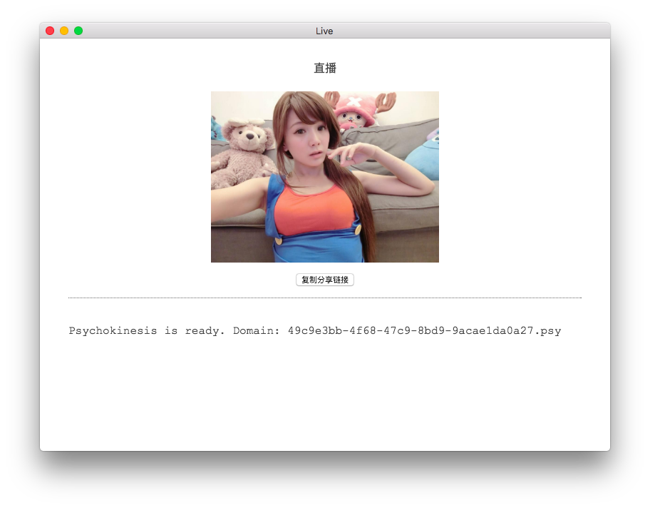

# Live



基于 [js-psychokinesis](https://github.com/psychokinesis-dev/js-psychokinesis) 和 HTML5 的直播应用。

## 特性
- 基于 HTTP 协议实现，极易进行扩展
- 基于开放的去中心化网络，搭建方便

## 下载
二进制包的下载链接请访问 [Release 页面](https://github.com/psychokinesis-dev/live/releases)。

## 构建
### 安装依赖
```bash
$ curl -o- https://raw.githubusercontent.com/creationix/nvm/v0.31.2/install.sh | bash
$ nvm install 5
$ nvm use 5
$ npm install
```

### 启动
```bash
$ npm start
```

### 打包
```bash
$ npm run-script pack
```